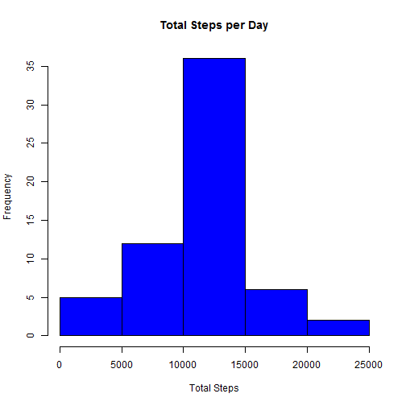

##Introduction
This assignment makes use of data from a personal activity monitoring device. This device collects data at 5 minute intervals through out the day. The data consists of two months of data from an anonymous individual collected during the months of October and November, 2012 and include the number of steps taken in 5 minute intervals each day.

The dataset and all related files can be accessed via this [link]("https://github.com/shazrul205/RepData_PeerAssessment1")

The data provided are analyzed and presented in this document.

## Loading and preprocessing the data
Here are the first few lines of the data:

```r
data <- read.csv(unz("activity.zip", "activity.csv"),colClasses = c("numeric","Date","numeric"))
head(data)
```

```
##   steps       date interval
## 1    NA 2012-10-01        0
## 2    NA 2012-10-01        5
## 3    NA 2012-10-01       10
## 4    NA 2012-10-01       15
## 5    NA 2012-10-01       20
## 6    NA 2012-10-01       25
```
As seen, there are 3 variables two of which are numerics and the other a Date variable. The variables are explained as below:

- steps: Number of steps taking in a 5-minute interval (missing values are coded as NA)
- date: The date on which the measurement was taken in YYYY-MM-DD format
- interval: Identifier for the 5-minute interval in which measurement was taken

## What is mean total number of steps taken per day?


The average total number of steps taken per day excluding all NA values is calculated as below:


```r
dataNoMissingValues <- filter(data,steps != "NA")
totalSteps <- dataNoMissingValues %>% group_by(date) %>%
                       summarize(total = sum(steps))
averageStepsPerDay <- mean(totalSteps$total)
averageStepsPerDay
```

```
## [1] 10766.19
```

The following figures show a histogram of the total steps


```r
hist(totalSteps$total, col = "red", main = "Total Steps per Day",
     xlab = "Total Steps", ylab = "Frequency")
```


The computed median is as below:

```r
med <- median(totalSteps$total)
med
```

```
## [1] 10765
```

So median of the total steps is 10765 and the mean is 10766

## What is the average daily activity pattern?

To obtain this information, it is required to group the data by the interval identifier and get the average steps for each group of identifier. Consequently, a time series plot can then be constructed using this data to see the average pattern of steps in a day. 


```r
aveStepsInterval <- dataNoMissingValues %>%
                            group_by(interval) %>%
                            summarize(mean = mean(steps))

with(aveStepsInterval, plot(interval, mean, type = "l", xlab = "Interval Identifier", ylab = "Number of Steps", main = "Average Daily Steps"))
```


As can be seen in the above figure, the maximum number of steps occur in the 5-minute interval which correspond to the 835 identifier.

## Imputing missing values
The presence of missing days may introduce bias into some calculations or summaries of the data. The following studies the impact of imputing missing data on the estimates of the total daily number of steps. This is then compared with the previous result obtained when NA values are ignored i.e. assumed to have no values.

For the purpose of this assignment, a simple strategy is used to impute the missing values. Missing values are imputed by inserting the average daily steps for each interval. For example, if the number of steps is missing for the 20th interval identifier, then this is replaced with the average value of 0.0754717. The followings are the steps involved.

See which column variable has NA values:

```r
any(is.na(data$steps))
```

```
## [1] TRUE
```

```r
any(is.na(data$date))
```

```
## [1] FALSE
```

```r
any(is.na(data$interval))
```

```
## [1] FALSE
```

Calculate the number of NA values

```r
totalNA <- sum(is.na(data$steps))
totalNA
```

```
## [1] 2304
```

The number of rows with NA values is therefore 2304.

Now, create a new dataset with the NAs replaced:

```r
##merge data with the average steps per interval dataset i.e. aveStepsInterval
imputedData <- merge(data,aveStepsInterval,by="interval")

##replace NA with the corresponding values from the mean variable
imputedData  <- transform(imputedData, steps = ifelse(is.na(steps), mean, steps))

##drop the mean variable
imputedData <- select(imputedData, -(mean))
```

Next, make a histogram of the total number of steps taken each day and Calculate and report the mean and median total number of steps taken per day.

```r
totalStepsDataImputed <- imputedData %>% group_by(date) %>%
                         summarize(total = sum(steps))

hist(totalStepsDataImputed$total, col = "blue", main = "Total Steps per Day",
     xlab = "Total Steps", ylab = "Frequency")
```



The median and mean are computed as below:

```r
medianDataImputed <- median(totalStepsDataImputed$total)
medianDataImputed
```

```
## [1] 10766.19
```

```r
meanDataImputed <- median(totalStepsDataImputed$total)
meanDataImputed
```

```
## [1] 10766.19
```

Comparing average steps between the original data and the imputed one:

1) Mean

- No missing values: 10766
- Missing values filled in: 10766

2) Median:

- No missing values: 10765
- Missing values filled in: 10766

As shown above, the median of both datasets do not differ whereas the mean for the dataset with NAs filled in only increased slightly. Therefore, filling in the missing values in the original dataset does not greatly impact the outcome of the data.

## Are there differences in activity patterns between weekdays and weekends?
In order to find out, firstly a new factor variable is created in the imputedData dataset with two levels - "weekday" and "weekend" indicating whether a given date is a weekday or weekend day.


```r
##assign days of weekends
weekEnds <- c("Saturday","Sunday")

##add the factor variable day.type
imputedData <- mutate(imputedData, dayType = factor((weekdays(date) %in% weekEnds), levels=c(TRUE, FALSE), labels=c('weekend', 'weekday')))
```

Next, a time series plot is created with two panels - one for weekday and another for weekend data. 


```r
dataForPanelPlot <- imputedData %>% 
                    group_by(dayType,interval) %>%
                    summarize(mean = mean(steps))

ggplot(dataForPanelPlot,aes(x=interval,y = mean))+
  geom_line(aes(fill = dayType))+
  facet_grid(dayType~.) +
  labs(title = "Average Daily Steps For Weekdays and Weekends")+
  labs(x="Interval Identifier", y="Number of Steps")
```


It can be clearly seen that there is a higher spike in number of stpes during he weekdays compared to the weekends. However, the steps are taken more in the weekends
